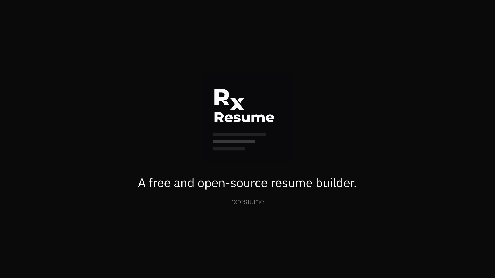

# 👋 Reactive Resume

<figure><figcaption></figcaption></figure>

_**Lazy Media is updating these documents to reflect the new ownership and information. Your patience during this process is appreciated.**_

_Discord Server coming soon for this version of Reactive Resume._

### _**NOTICE:**_

_**Known Issues for v1.1.8:**_\
_**If resume refuses to open after updating to v1.1.8, please do the following steps to fix it:**_\
_**1. Edit your resume name by 1 character**_\
_**2. Open resume**_\
_**3. Edit each job for resume**_\
_**4. Under \`Type of Employment\` either select your choice or leave as is with \`N/A\`**_\
_**5. Click Save**_\
_**6. Repeat steps 4 & 5 for each job**_\
_**7. Change resume name back to original**_

_**We apologize for any inconvenience this may cause, and we are currently trying to fix it.**_

***

## Overview

Reactive Resume is a free and open-source resume builder that simplifies the process of creating, updating, and sharing your resume. With zero user tracking or advertising, your privacy is a top priority. The platform is extremely user-friendly and can be self-hosted in less than 30 seconds if you wish to own your data completely.

It's available in multiple languages and comes packed with features such as real-time editing, dozens of templates, drag-and-drop customisation, and integration with OpenAI for enhancing your writing.

You can share a personalised link of your resume to potential employers, track its views or downloads, and customise your page layout by dragging-and-dropping sections. The platform also supports various font options and provides dozens of templates to choose from. And yes, there's even a dark mode for a more comfortable viewing experience.

Start creating your standout resume with Reactive Resume today!
