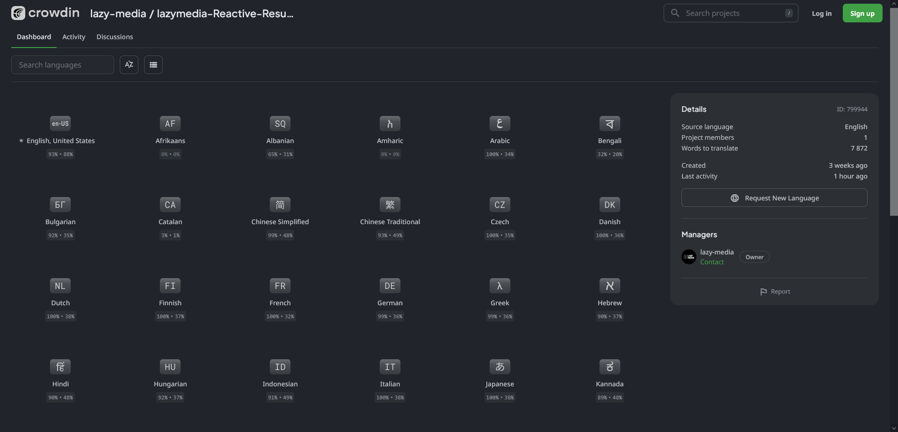
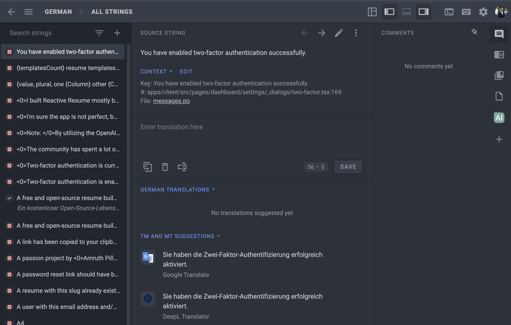
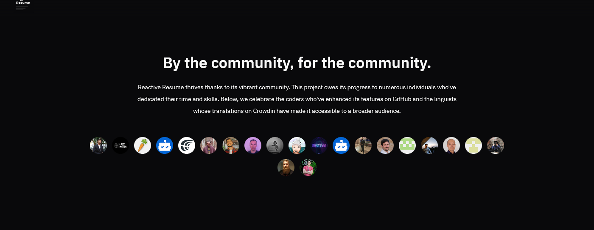

# 🇧🇷 Translating Reactive Resume into your language

If you speak a language other than English, please consider helping to translate Reactive Resume into your native language. You can sign up to be a translator even if your language is already translated, this would ensure that you get updated whenever the app adds new phrases to be translated.

By making the app available in multiple languages, more people in non-English dominant regions can use the app, create their own professional resumes, and feel included.

To translate Reactive Resume, simply create an account on Crowdin or head on over to [https://crowdin.com/project/lazymedia-reactive-resume](https://crowdin.com/project/lazymedia-reactive-resume) which redirects you to the Crowdin project page. Here, you can see a list of languages that are available for translations.

<figure><figcaption></figcaption></figure>

To start working on a specific language, simply click on the flag/locale associated with the language and you should see a button titled “Translate All”. Click on that button, and you would be redirected to the editor where you can begin translating each phrase, one-by-one.

<figure><figcaption></figcaption></figure>

Crowdin also provides you with machine translations provided by Google Translate or DeepL, which you can use as a reference point and tweak the result to something more suitable.

To save the translations for each phrase, all you need to do is type in the translated phrase and click on Save (or you can also press `Ctrl` + `Enter`) and it would automatically move you to the next phrase to be translated.

Contributing to the translations on Crowdin also gets you a coveted spot on the home page's wall of fame.

<figure><figcaption></figcaption></figure>

