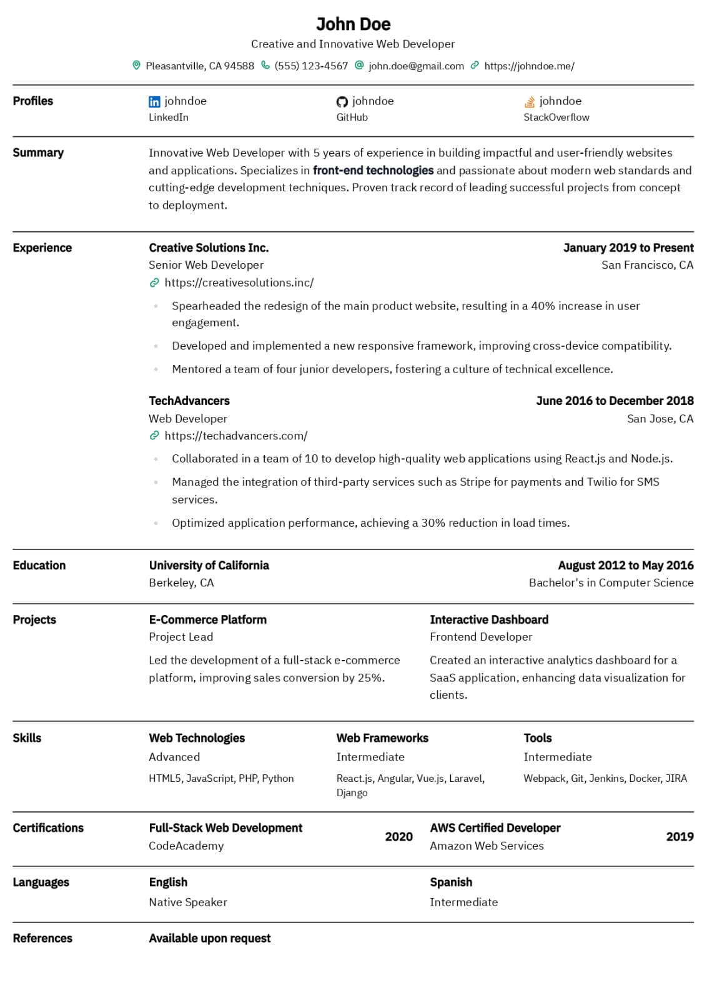
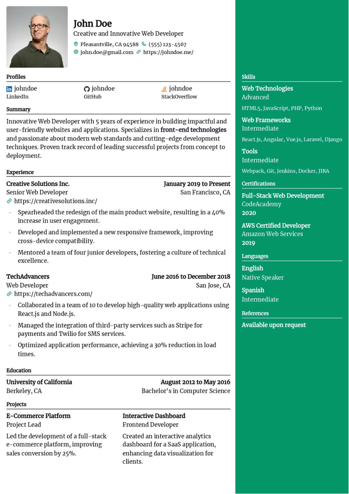
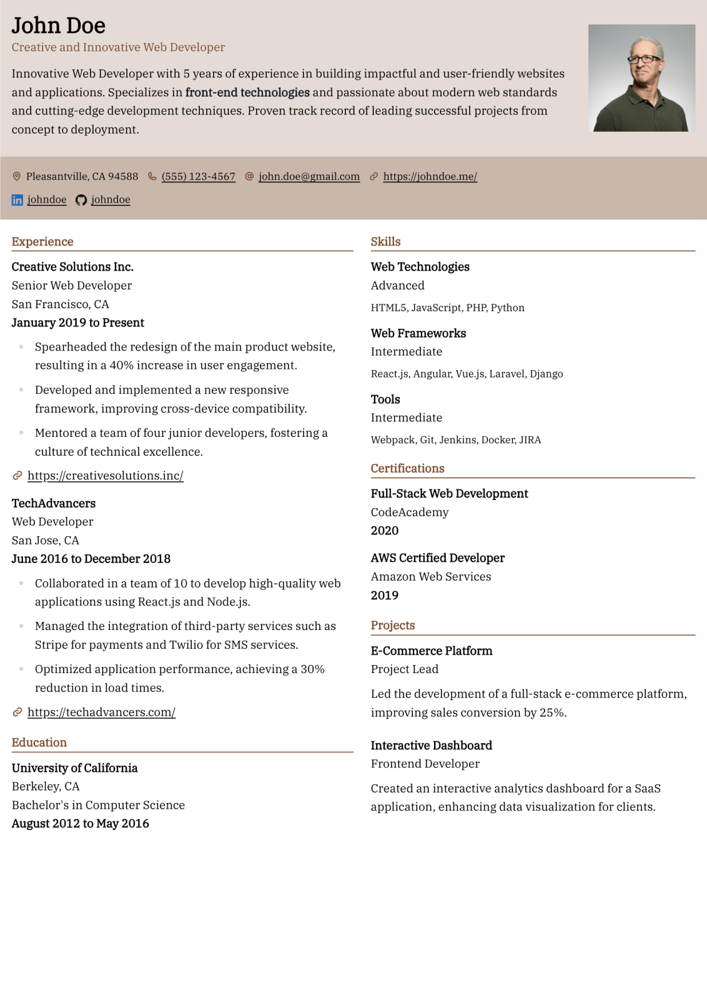
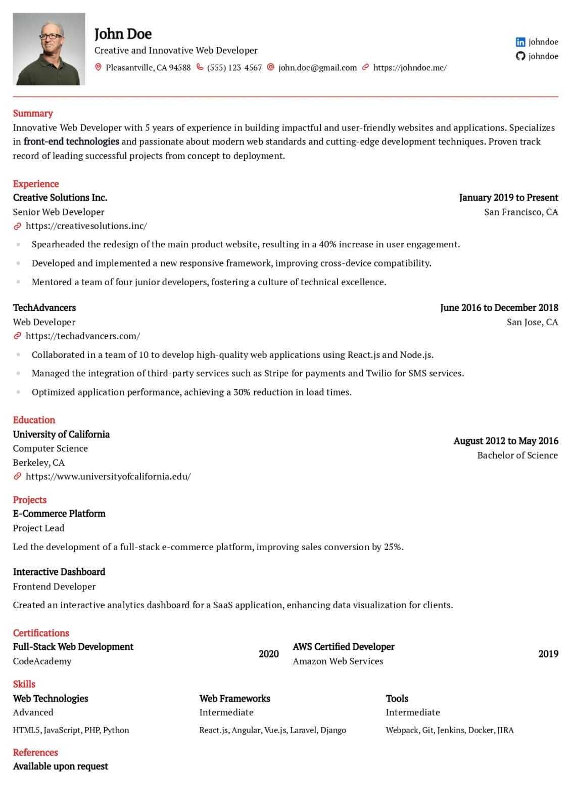
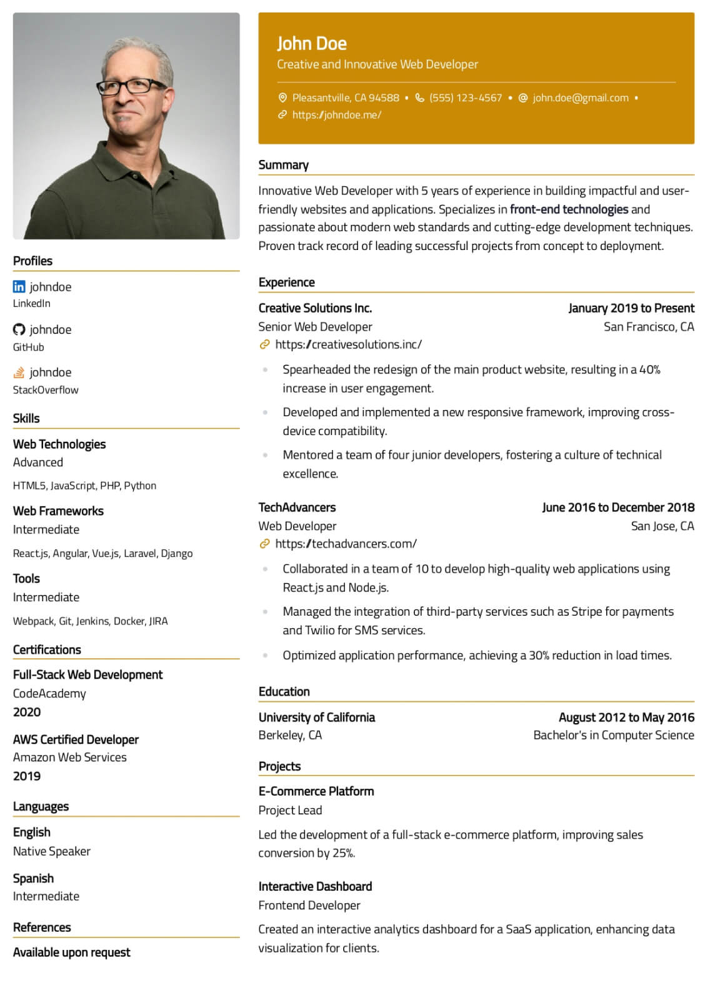

# ✨ Features

## Manage Multiple Resumes

Under a single account, you're free to handle an unlimited number of resumes—there are no restrictions, no paywalls. It's common practice to have several variations of a single resume template, each slightly tailored to suit specific job descriptions. Reactive Resume is ideally suited for such customization.

<figure><figcaption></figcaption></figure>

## Realtime Editing

Make changes to your resume and see them reflected on your page immediately. Your updates are "reactive", so you can make the best design decisions without having to look at a loading spinner.

<figure><figcaption></figcaption></figure>

## Single or Multi-Column Sections

Inarguable, single columns are the way to go for maximum ATS compatibility, but some people don't want to target ATS systems, and want their resume to look good, while trying to fit in as much information as possible. The decision to go single column or multi-column should be up to you, and it's possible with Reactive Resume in just a few clicks.

<figure><figcaption></figcaption></figure>

## Multiple Templates

|               Azurill               |               Bronzor               |               Chikorita               |
| :---------------------------------: | :---------------------------------: | :-----------------------------------: |
|  |  |  |

|               Ditgar               |               Ditto               |               Gengar               |
| :--------------------------------: | :-------------------------------: | :--------------------------------: |
|  |  |  |

|               Glalie               |               Kakuna               |               Leafish               |
| :--------------------------------: | :--------------------------------: | :---------------------------------: |
|  |  |  |

|               Nosepass               |               Onyx               |               Pikachu               |
| :----------------------------------: | :------------------------------: | :---------------------------------: |
|  |  |  |

|                Ryhorn               |
| :---------------------------------: |
|  |

## Other Features

There's honestly just too many to count, and there are new features being baked into the app everyday. But here's a neat little slide that summarizes all the major features of Reactive Resume.

<figure><figcaption></figcaption></figure>
