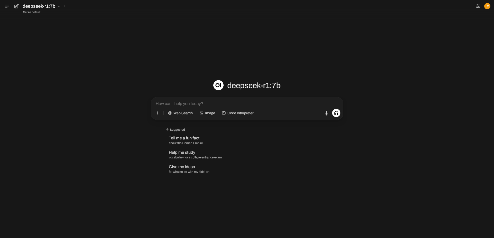
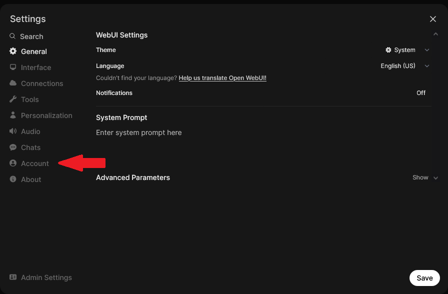
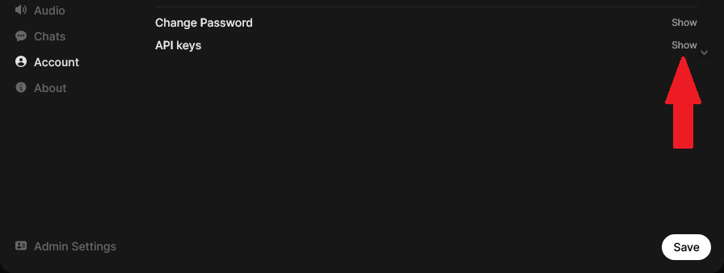
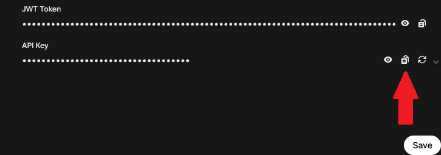
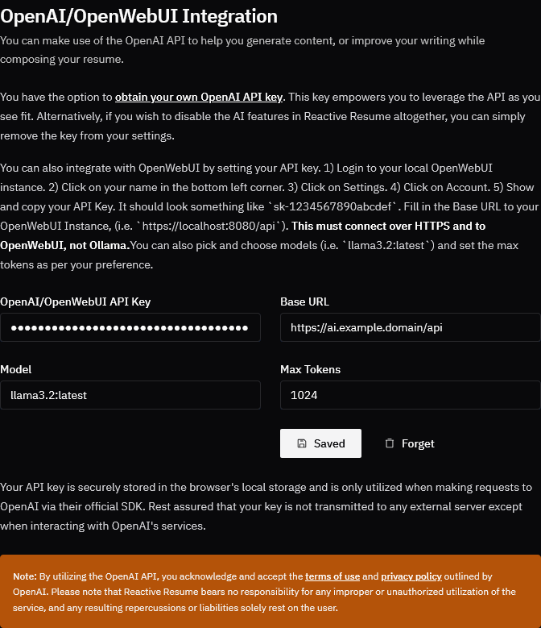
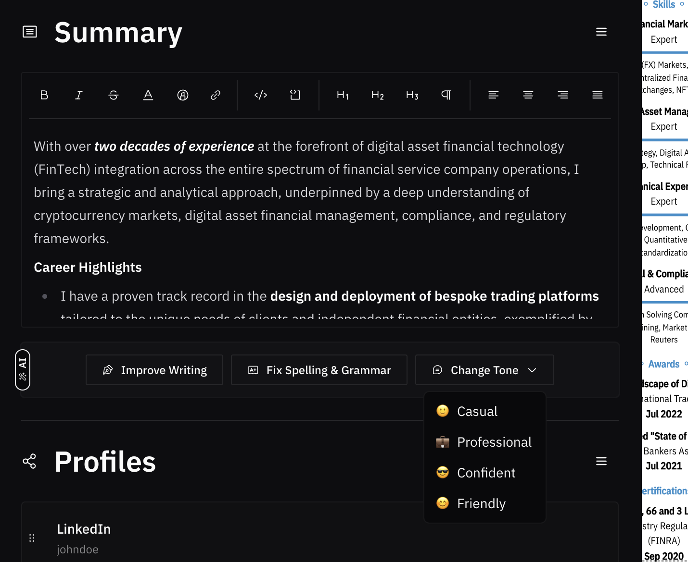

# 🧠 Enabling OpenWebUI / Ollama Integration

This feature is in an experimental phase and could undergo many changes throughout the development of the app.

OpenWebUI has been a game-changer for all of us. I cannot tell you how much OpenWebUI has helped me in my everyday work and with the development of Reactive Resume. It only makes sense that you leverage what AI has to offer and let it help you build the perfect resume.

While most applications out there charge you a fee to use their AI services (rightfully so, because it isn't cheap), you can choose to enter your own OpenWebUI API key on the Settings page (under OpenWebUI Integration). **The key is stored in your browser's local storage**, which means that if you uninstall your browser, or even clear your data, the key is gone with it. All requests made to OpenWebUI are also sent directly to their service and does not hit the app servers at all.

The policy behind "bring your own key" (BYOK) is [still being discussed](https://community.openai.com/t/openais-bring-your-own-key-policy/14538/46) and probably might change over a period of time, but while it's available, I would keep the feature on the app.

You are free to turn off all AI features (and not be aware of its existence) simply by not adding a key in the Settings page and still make use of all the useful features that Reactive Resume has to offer.

**I would even suggest you to take the extra step of using Ollama / OpenWebUI to write your content, and simply copy it over to Reactive Resume.**

## How to get an OpenWebUI API key?

Firstly, create an account on OpenWebUI Self Hosted Instance of your choice, if you don't already have one. For the purposes of being brief, I'll not go over how to set up an OpenWebUI account. There should be enough guides on the internet to do this, which would explain the process much better than I can.

Head over to the [OpenWebUI](https://openwebui.com/) page and click on the **Get Open WebUI** button.

Set this up and get it connected to your local Ollama Instance.\
&#xNAN;_&#x49; will not be explaining this documentation here. You can do a Google Search on how to host Ollama and OpenWebUI._

Now Login to your newly created OpenWebUI Instance. You should be presented with a page that looks similar to the one below.

<figure><figcaption></figcaption></figure>

Now, head over to the _Profile Icon_ on the top right corner _(yellow dot in pic)_ and click on it, then click on _Settings_. You should be presented with a page that looks like the one below. You will want to click on _Account_ (like the arrow shows).

<figure><figcaption></figcaption></figure>

You will then be presented with a page that looks like the one below. You will need to click on _Show._

<figure><figcaption></figcaption></figure>

After clicking on _Show,_ you will be presented with the screen that looks similar to this.

<figure><figcaption></figcaption></figure>

Your key should begin with `sk-`, this is how Reactive Resume validates that the key is indeed an OpenAI / Open WebUI API key.

## Enabling OpenAI / Open WebUI in Reactive Resume

Once you have the secret key from OpenWebUI, head over to the settings page in Reactive Resume, and to the sub-section named "OpenAI/OpenWebUI Integration".

Here, you can enter the API key provided, and click on "Store Locally".

You will also need to fill in the Base URL with the Open WebUI Instance you are using. As of right now, this only seems to work over HTTPS connections, not HTTP connections, so a FQDN is recommended.

Fill in the model with an available model on your local AI. It is recommended to enter the model you want to use as something like `llama3.2:latest`  or whatever model you want to use.

<figure><figcaption></figcaption></figure>

Your API key is securely stored in the browser's local storage and is only utilized when making requests to OpenAI / Open WebUI via their official SDK. Rest assured that your key is not transmitted to any external server except when interacting with OpenAI or Open WebUI services.

Now, you should be able to see some new sections pop up in the Resume Builder screen where you can take advantage of all the one-click AI actions.

<figure><figcaption></figcaption></figure>
