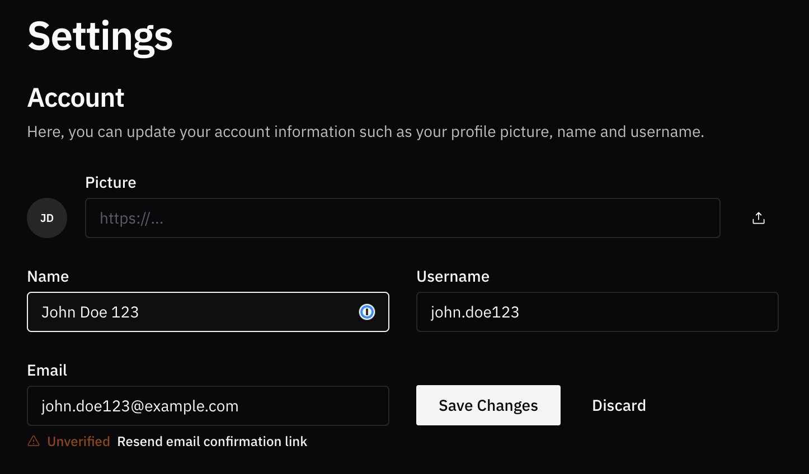

# 🖊️ Updating your profile

If you need to revise your name, username, email address, or add a photo to your account, this section is designated for those updates.

Once you are logged in, head over to the [settings page](https://rxresume.org/dashboard/settings). The account section should have all the fields you need to update.

To update your picture, just click the upload button on the right and select an image from your computer. The URL field will be populated automatically once the upload finishes.

Whenever you modify your profile details, like your name or username, a 'Save Changes' button will appear. Please note that your changes won't be committed until you click on this button.

<figure><figcaption></figcaption></figure>

Should you opt to alter your email address on this page, you will be sent a message containing a link to confirm the new email. Clicking on this link will finalize the update of your email address.
